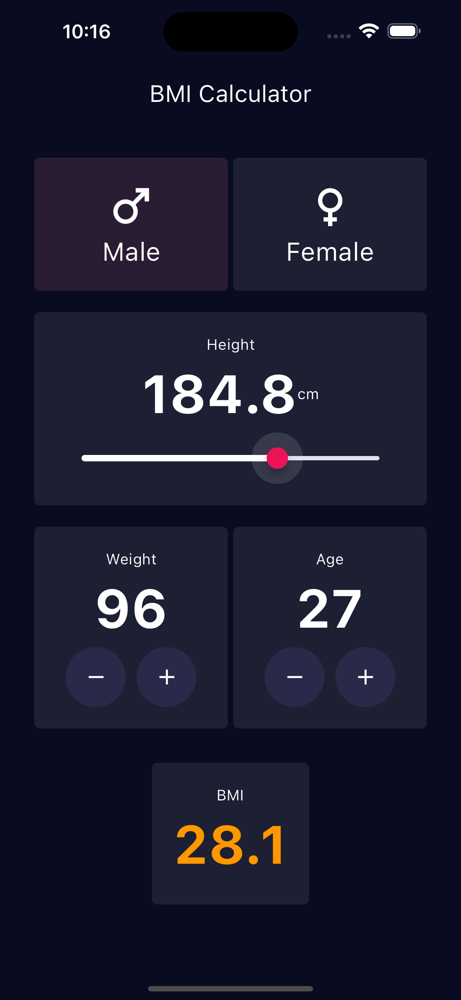

# Flutter BMI Calculator Demo
This repository contains a simple Body Mass Index (BMI) calculator built using Flutter. It serves as a demo project completed during a Flutter course and showcases basic functionalities of the framework.

## Features:

* User input fields for weight and height.
Calculates BMI based on user input.
* Displays the calculated BMI value.
* Categorizes BMI into Underweight, Normal Weight, Overweight, or Obese based on standard guidelines.
Purpose:

This project provides a practical example of building a user-friendly application with Flutter. It demonstrates:

* Working with user input.
Performing calculations based on user input.
* Implementing conditional logic for displaying results.

## Target Audience:

This repository is ideal for Flutter beginners looking for a practical example project to understand core concepts of the framework.

**Note:**

This is a basic demo project and does not encompass advanced features of a full-fledged BMI calculator application.